# TIFFINBOX
An Android application using Android Studio and Firebase Firestore that connects people looking to get an income using home cooking to customers.

## Contributors:
Shreya Pandey

Swarali Mahimkar

Krishil Shah

Aman Tiwari

## Tools Used:
1. Java Programing Language
2. Android Studio
3. Firebase for authentication and data storage

## Features:
* This app helps users to get home-cooked meals.
* This app connects two people: a cook and a customer. It provides employment to home cooks as another form of income as well as helps customers benefit from a healthy home-cooked meal.
* Chefs can upload the details of meals/items, they can see all received order lists, and they will receive a notification when the customer places any order.
* Chefs can create their own coupons to provide discounts to their customers.
* A customer can place an order of their choice and put items in the cart.
* A customer can order a variety of thalis from multiple chefs.

## Implementation Screenshots:

  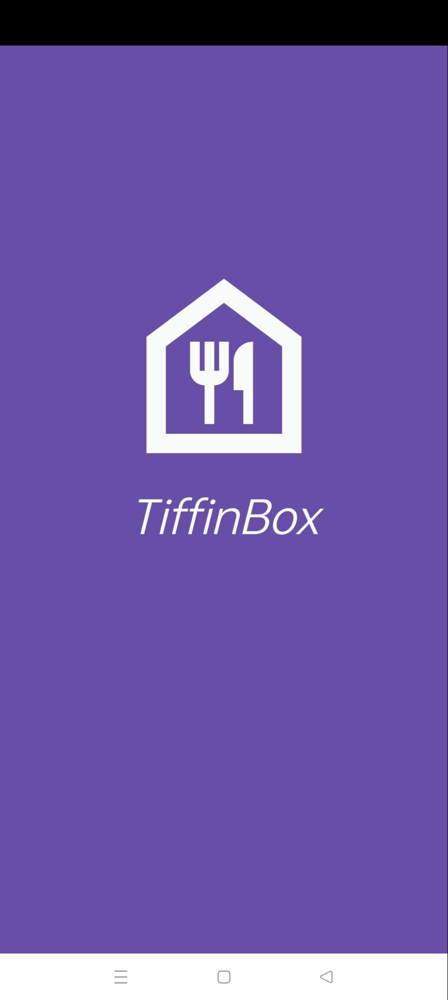
  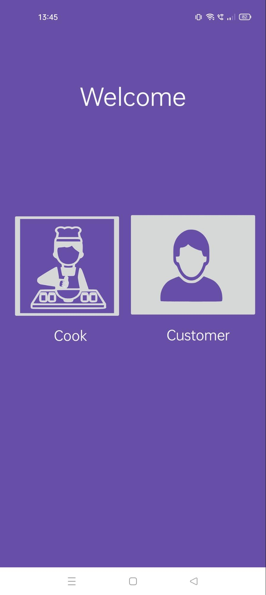
  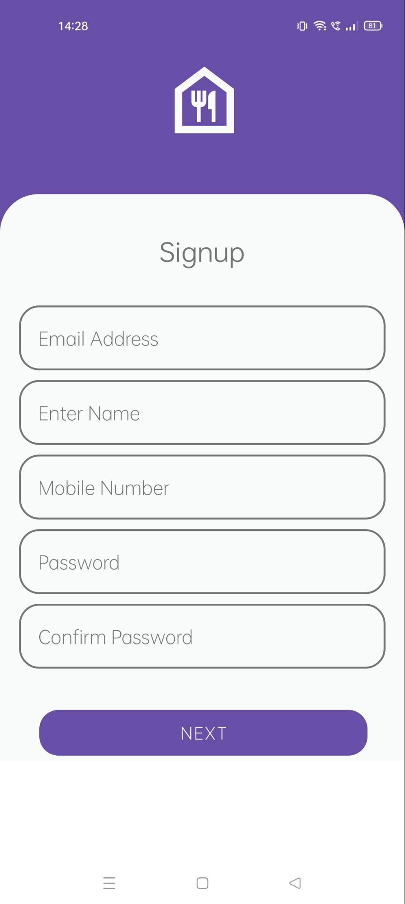

  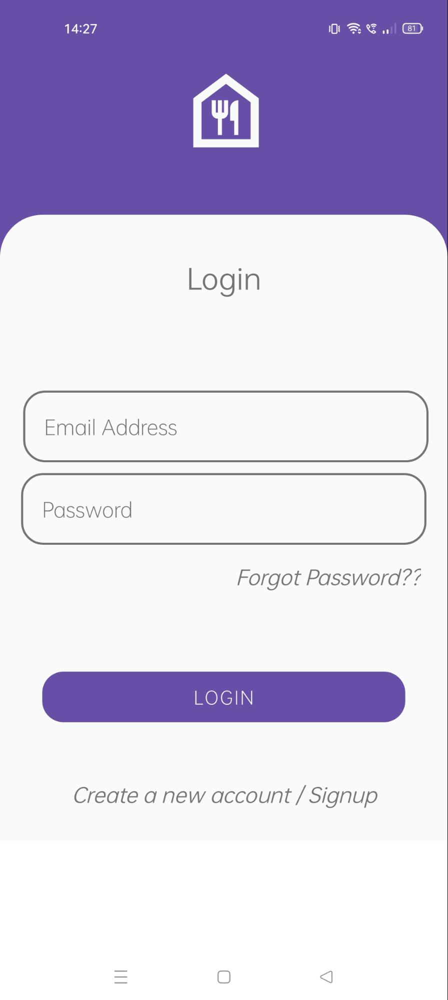
  
  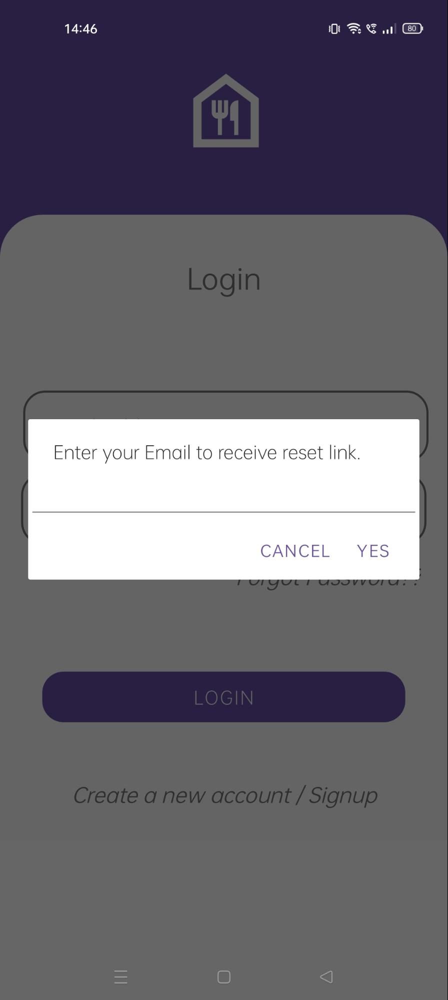

### Chef's Screen

  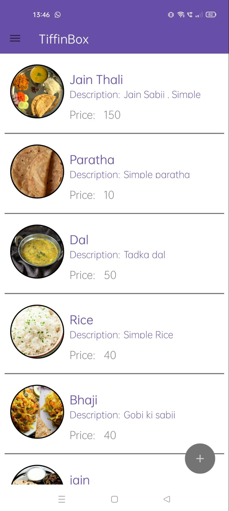
  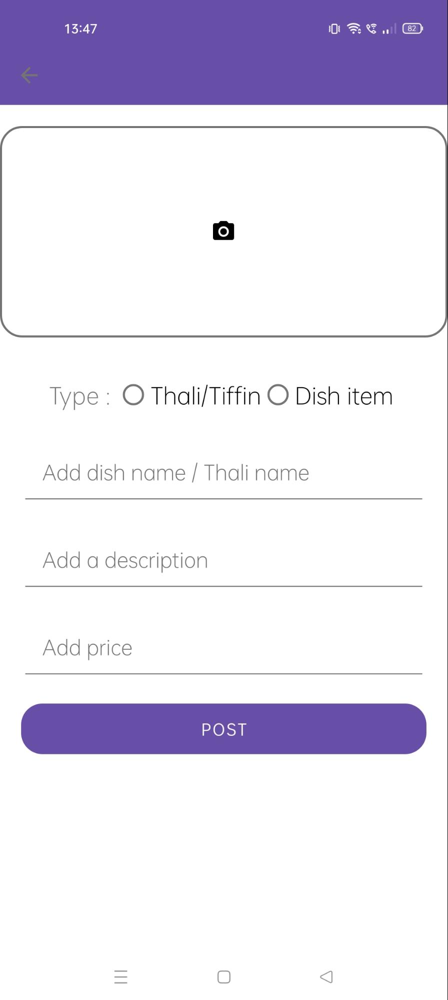
  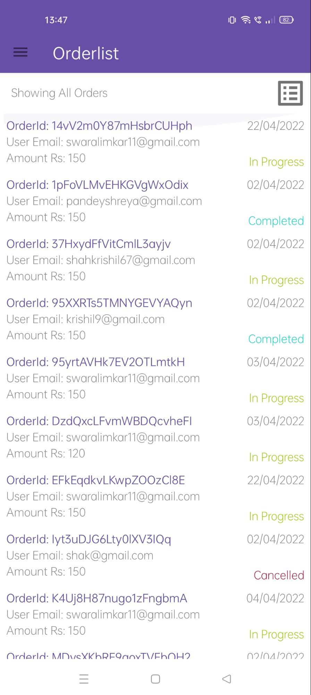
  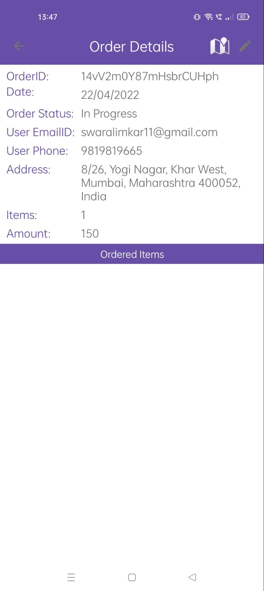

  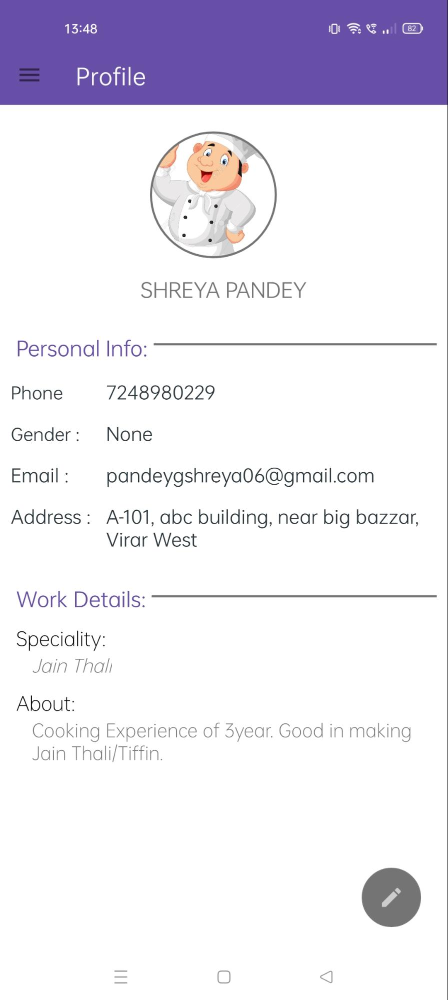
  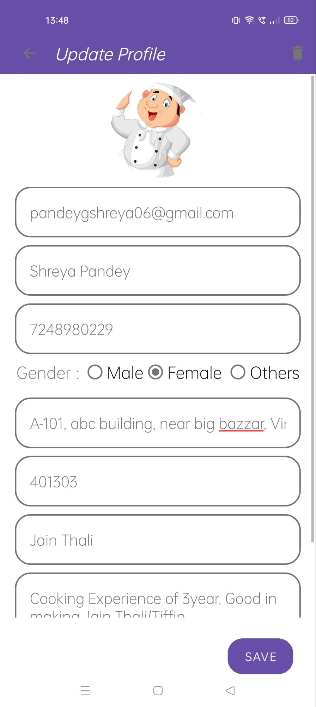
  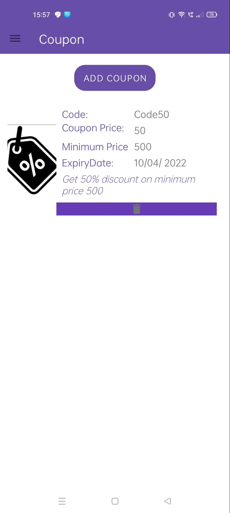
  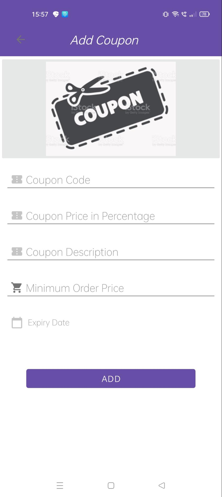

### Customer's Screen

  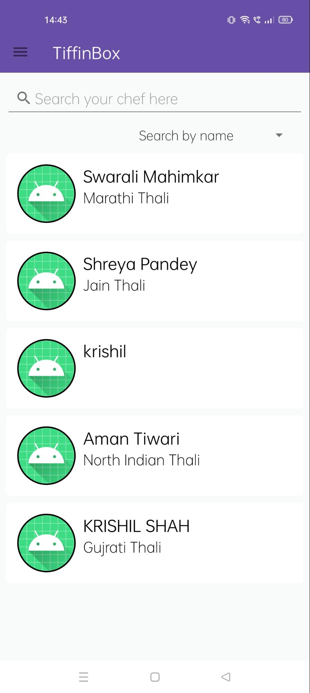
  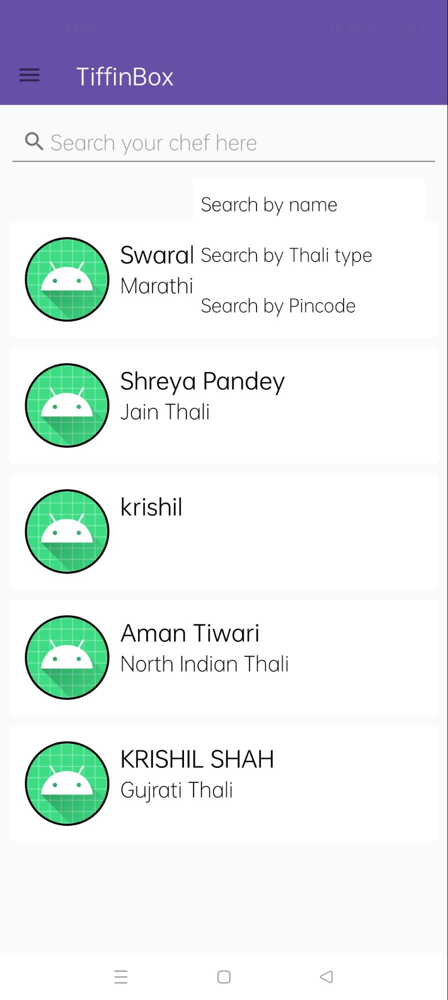
  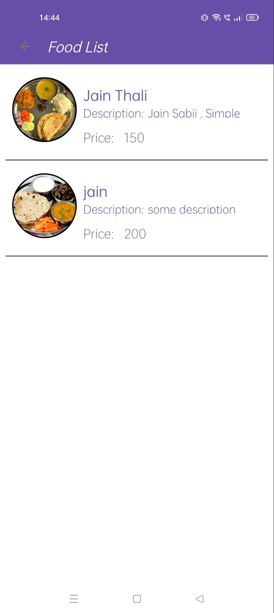
  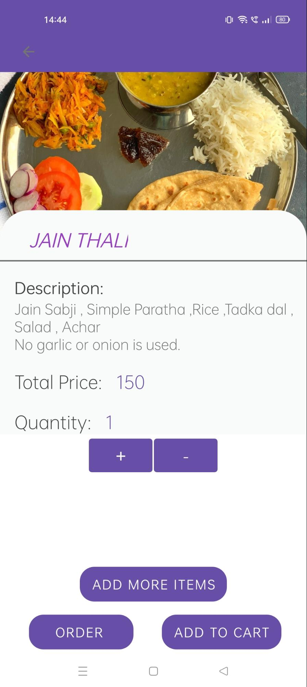

  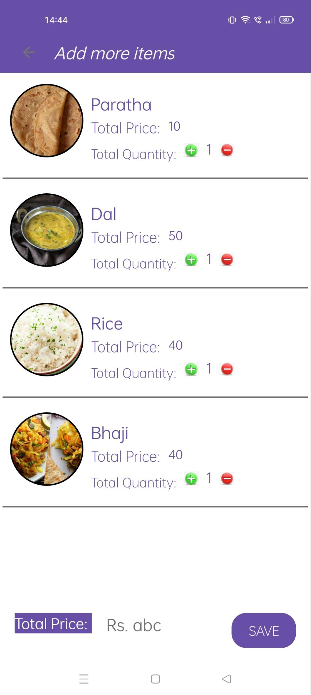
  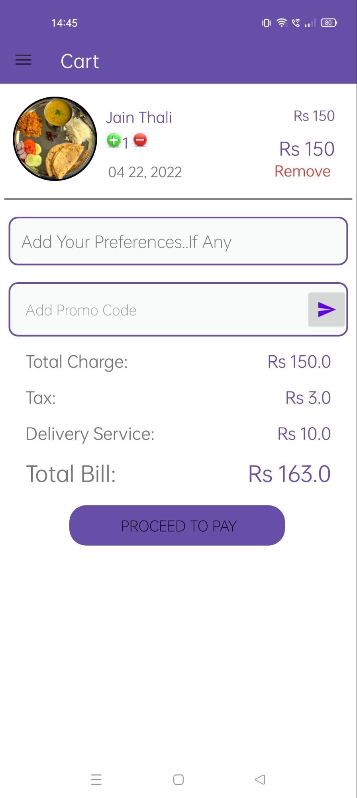
  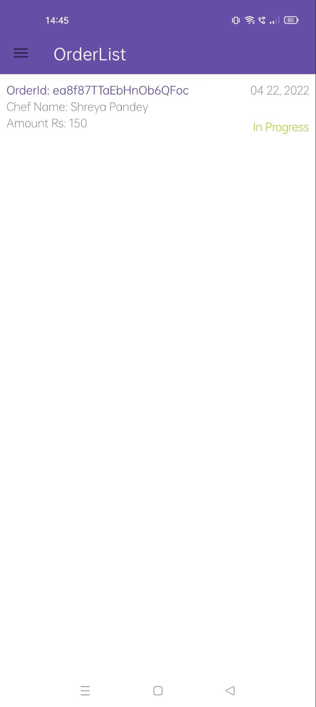
  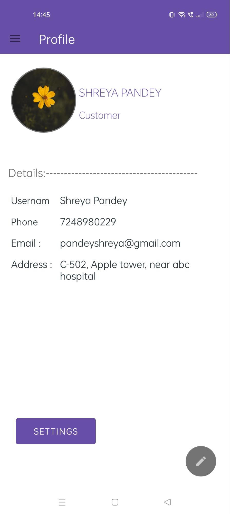

